# Proyecto 8. Seguridad en conexiones invisibles

## Parte 1: Guía de Bastionado — TP-Link Archer AX55 (AX3000, Wi‑Fi 6)

## Resumen ejecutivo

El TP-Link Archer AX55 es un router Wi‑Fi 6 (802.11ax) de gama media orientado a uso doméstico y SOHO (Small Office / Home Office). Dispone de capacidad AX3000, conectividad simultánea en 2,4 GHz y 5 GHz, cuatro puertos Gigabit Ethernet, puerto USB 3.0 para almacenamiento compartido y servidor VPN integrado compatible con OpenVPN y WireGuard.

Aunque se trata de un equipo pensado para el entorno doméstico, su papel como puerta de entrada a la red local lo convierte en un elemento crítico desde el punto de vista de la seguridad. Un firmware desactualizado, servicios innecesarios expuestos o una configuración débil pueden facilitar el acceso no autorizado a la red o a los dispositivos conectados.

En este trabajo he aplicado distintas medidas de bastionado sobre el AX55 utilizando el emulador oficial de TP-Link. Las configuraciones que aparecen en las capturas han sido ajustadas por mí de forma intencionada para endurecer el equipo, y las imágenes sirven como prueba visual de cada cambio realizado.

> *Referencia al emulador:* todas las rutas de configuración incluidas en esta guía han sido verificadas sobre el emulador web oficial de TP-Link, accesible en [https://www.tp-link.com/us/support/emulator/](https://www.tp-link.com/us/support/emulator/). El emulador permite explorar la interfaz de administración sin disponer del hardware físico.

---

## 1. Superficie de ataque y threat model

Antes de aplicar medidas de bastionado, es importante identificar los vectores de ataque más relevantes para este dispositivo. En un router doméstico, cualquier debilidad puede tener un impacto elevado porque el equipo actúa como frontera entre la red interna e Internet.

| Vector | Descripción | Probabilidad | Impacto |
|--------|-------------|--------------|---------|
| Acceso al panel web desde LAN | Cualquier dispositivo de la red local puede intentar autenticarse en el panel de administración. | Alta | Crítico |
| Acceso al panel web desde WAN | Si la administración remota está habilitada, el panel queda expuesto a Internet. | Media | Crítico |
| Explotación de servicios activos | Servicios como UPnP, FTP o similares amplían la superficie de ataque. | Alta | Alto |
| Captura de credenciales Wi‑Fi | Ataques de diccionario offline contra handshakes WPA2. | Alta | Alto |
| Ataques a dispositivos IoT | Un IoT comprometido puede servir como punto de partida para movimiento lateral dentro de la red. | Media | Alto |
| Vulnerabilidades conocidas | Firmware sin parchear expone RCE, command injection o auth bypass. | Alta | Crítico |
| Ataque físico | El botón de reset puede restaurar la configuración por defecto. | Baja | Alto |

---

## 2. CVEs relevantes en la familia Archer

La familia Archer de TP-Link ha acumulado vulnerabilidades relevantes en los últimos años. Aunque algunos CVEs afectan formalmente a otros modelos, comparten componentes, servicios y lógica de administración con el AX55, por lo que son útiles como referencia de riesgo.

| CVE | CVSS | Afecta a | Descripción | Medida de mitigación |
|-----|------|----------|-------------|----------------------|
| CVE-2025-15517 | Crítica | Archer NX200 / NX210 / NX500 / NX600 | Authorization bypass por ausencia de comprobación de autenticación en endpoints HTTP CGI. | Desactivar administración remota WAN y actualizar firmware. |
| CVE-2025-15518 | Alta | Archer NX series | Hardcoded cryptographic key en archivos de configuración. | Actualizar firmware. |
| CVE-2025-15519 | Alta | Archer NX series | Input validation flaw en endpoints CGI. | Actualizar firmware y deshabilitar servicios expuestos. |
| CVE-2025-14756 | Alta | Archer MR600 v5 | Command injection autenticado en la interfaz de administración. | Cambiar credenciales, actualizar firmware. |
| CVE-2025-7850 | Alta | Archer con WireGuard | OS command injection vía configuración WireGuard. | No usar WireGuard en firmware sin parchear. |
| CVE-2025-7851 | Alta | Archer (múltiples) | Código de depuración residual con acceso root no autorizado. | Actualizar firmware. |
| CVE-2025-62501 | 7.0 | Archer (múltiples) | Misconfiguración de SSH hostkey con posible MITM. | Deshabilitar SSH si no se usa y actualizar firmware. |
| CVE-2026-0630 / CVE-2026-22221-22229 | Hasta 8.6 | Archer BE230 Wi‑Fi 7 | Múltiples inyecciones de comandos en módulos web, VPN, cloud y backup. | Aplicar mínimo privilegio y reforzar el acceso admin. |
| CVE-2022-30075 | Alta | Archer AX50 | RCE autenticado en firmware 210730. | Actualizar a firmware >= 220303. |

> **Fuentes de referencia:** TP-Link Security Advisory Portal, NVD/NIST, CSA Singapore Advisory AL-2026-028 e INCIBE.

---

## 3. Medidas de bastionado

Las medidas siguientes están organizadas de mayor a menor criticidad. En cada caso se indica la ruta exacta dentro del panel web del AX55, la justificación técnica y el riesgo asociado si la medida no se aplica. Todas las capturas muestran la configuración que yo he dejado aplicada en el emulador para endurecer el router. Utilizamos la versión V4 del router Archer AX55.

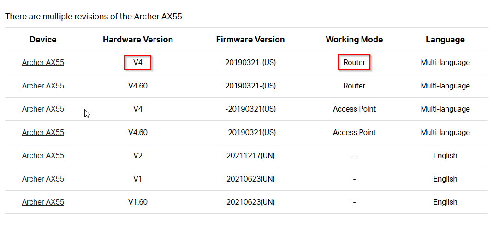

### 3.1 Actualizar el firmware inmediatamente

**Criticidad:** CRÍTICA  
**Ruta:** `Advanced → System → Firmware Upgrade`

La mayoría de los CVEs citados en esta guía disponen de correcciones publicadas. Mantener el firmware desactualizado deja el dispositivo expuesto a vulnerabilidades conocidas, varias de ellas explotables de forma remota. Además, la CSA de Singapur emitió en marzo de 2026 un aviso urgente para que los usuarios de dispositivos Archer actualizaran de inmediato tras la publicación de CVE-2025-15517.

En el emulador se observa que existe una versión más reciente disponible, por lo que pulsé **Update Now** e inicié la actualización. La captura refleja el proceso en curso y sirve como evidencia de que el firmware se trató como una prioridad de seguridad.

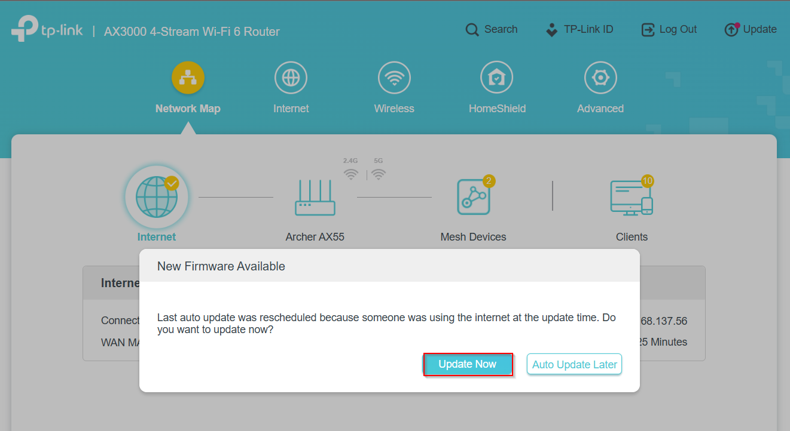

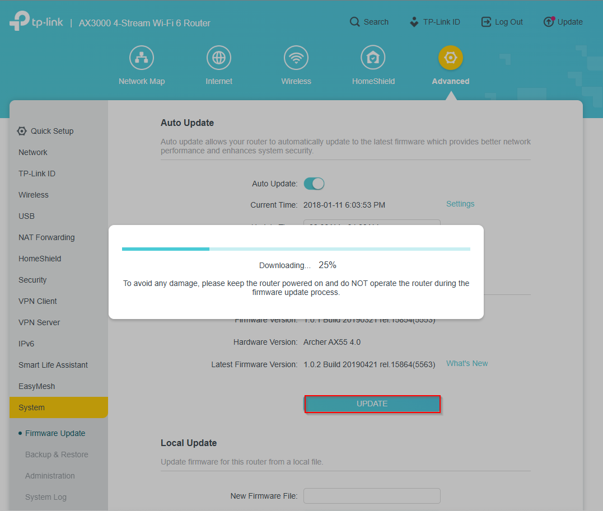

### 3.2 Cambiar las credenciales de administración por defecto

**Criticidad:** CRÍTICA  
**Ruta:** `Advanced → System → Administration`

Las credenciales por defecto, como `admin/admin` o variantes derivadas del número de serie, son las primeras que prueban las botnets y los atacantes automatizados. En el caso de CVE-2025-14756, la autenticación previa es un requisito, de modo que unas credenciales robustas actúan como una barrera efectiva frente a ese tipo de explotación.

En el emulador sustituí la contraseña por defecto por una nueva contraseña fuerte y no reutilizada. La captura muestra el formulario ya configurado, con el valor original en el campo **Old Password** como punto de partida del cambio.

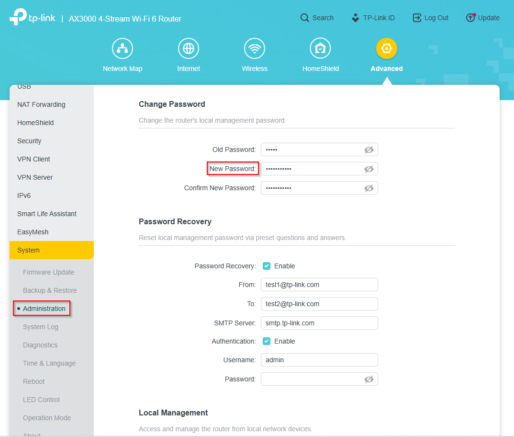

**Requisitos mínimos de la contraseña:**
- Longitud mínima de 16 caracteres.
- Combinación de mayúsculas, minúsculas, números y símbolos.
- No reutilizar contraseñas de otros servicios.
- Guardarla en un gestor de contraseñas como Bitwarden o KeePassXC.

**Medidas adicionales recomendadas:**
- Cambiar el nombre de usuario de administración si el firmware lo permite.
- Configurar un tiempo de sesión corto, de 5 a 10 minutos, para cerrar sesiones inactivas.

### 3.3 Deshabilitar la administración remota desde WAN

**Criticidad:** CRÍTICA  
**Ruta:** `Advanced → System → Administration → Remote Management`

Si la administración remota está activa, el panel de administración queda expuesto directamente a Internet. En ese escenario, vulnerabilidades como CVE-2025-15517 pueden explotarse desde fuera de la red local sin necesidad de acceso previo a la LAN.

En el emulador dejé **Remote Management** desactivado y mantuve **Local Management via HTTPS** activo y restringido a dispositivos concretos mediante MAC address. Esta combinación reduce de forma significativa la exposición del panel y limita el acceso administrativo a equipos autorizados.

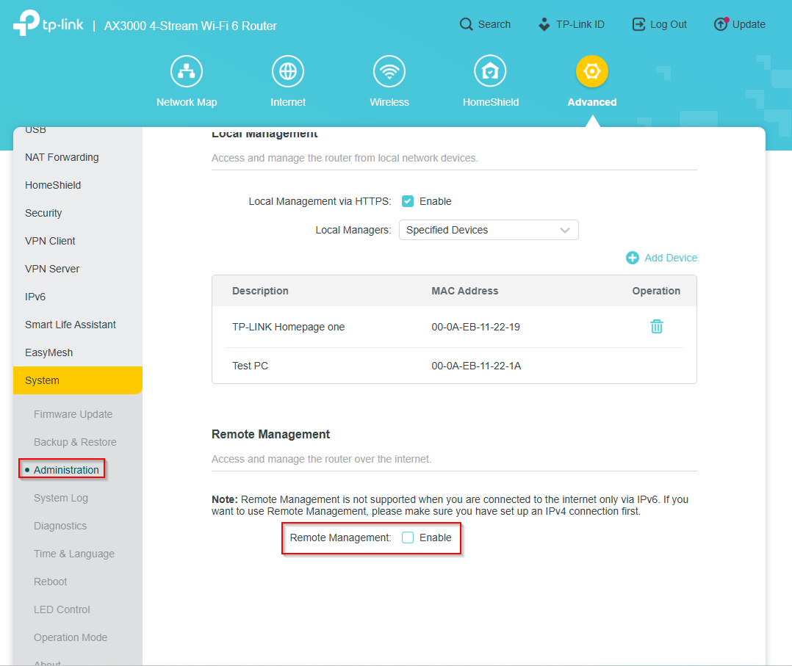

### 3.4 Forzar HTTPS para la administración local

**Criticidad:** ALTA  
**Ruta:** `Advanced → System → Administration → Local Management`

Administrar el router mediante HTTP en texto plano expone credenciales y sesiones a interceptación en la red local. En redes Wi‑Fi, un atacante con capacidad de MITM puede capturar tráfico de administración si no se cifra la conexión.

En la captura se observa que **Local Management via HTTPS** está habilitado y que el acceso queda restringido a **Specified Devices**. Esta configuración combina cifrado en tránsito con control de acceso por origen, lo que es una buena práctica para el panel local.

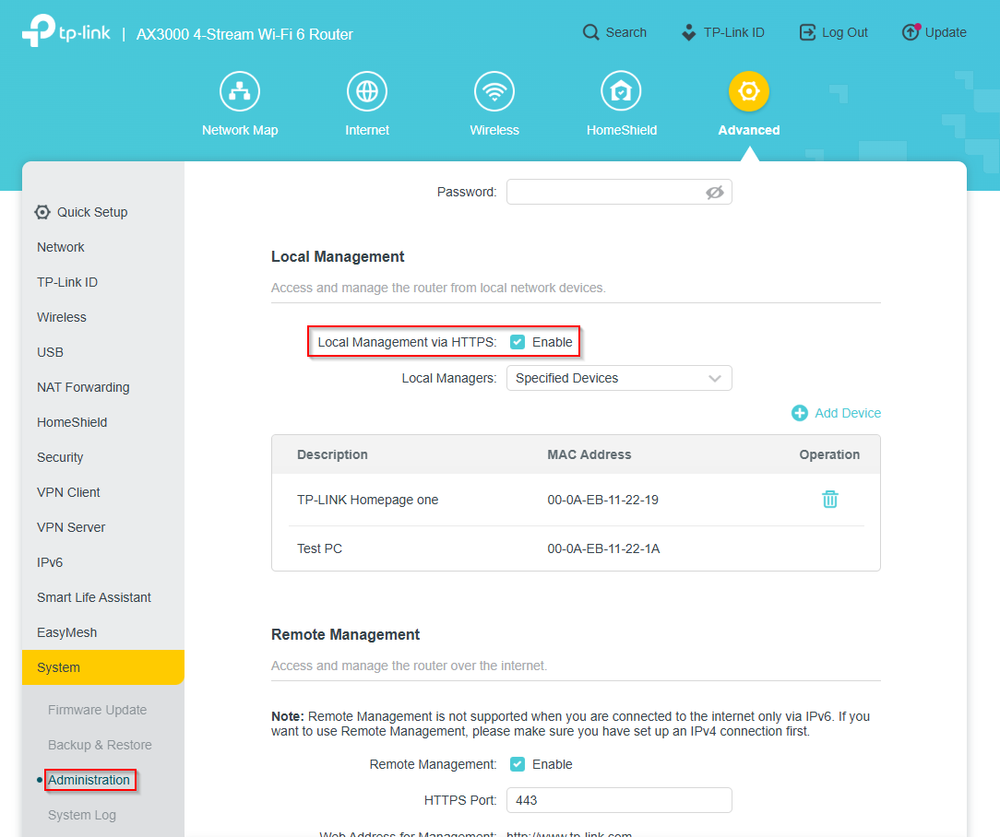

### 3.5 Deshabilitar UPnP

**Criticidad:** ALTA  
**Ruta:** `Advanced → NAT Forwarding → UPnP`

UPnP permite que dispositivos de la red local abran puertos en el firewall sin autenticación explícita. Aunque resulta cómodo para ciertos servicios, también puede ser aprovechado por malware o por dispositivos comprometidos para exponer servicios internos hacia Internet.

En el emulador desactivé UPnP por completo. Esta decisión elimina una vía de apertura automática de puertos y obliga a administrar cualquier reenvío de forma manual y controlada.

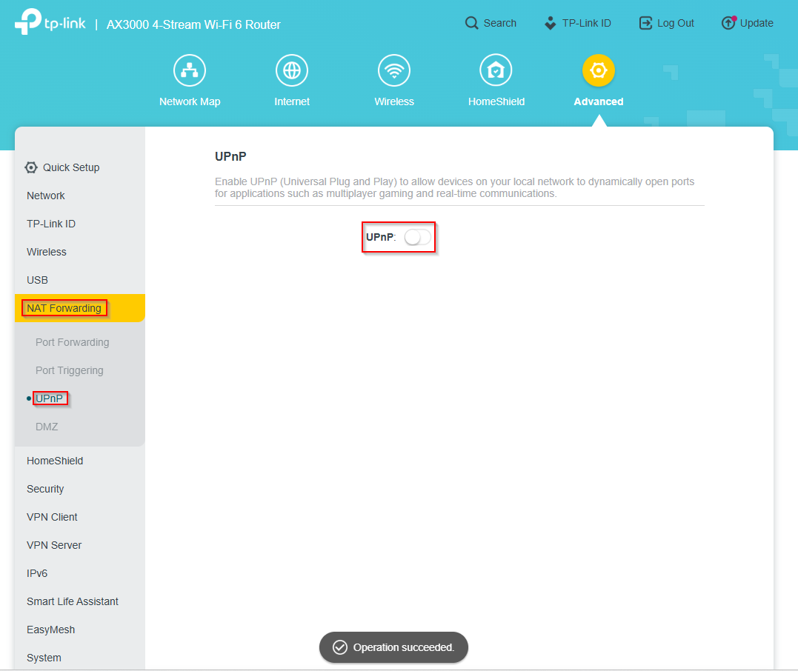

### 3.6 Configurar WPA3 y deshabilitar WPS

**Criticidad:** ALTA  
**Ruta:** `Wireless → Wireless Settings → Security`

WEP es inseguro, WPA con TKIP está obsoleto y WPA2-Personal depende en gran medida de la fortaleza de la contraseña. WPS con PIN, por su parte, reduce el espacio de búsqueda efectivo y puede ser atacado por fuerza bruta con herramientas públicas.

En el emulador configuré el SSID `Pandora`, activé la opción **Hide SSID** y seleccioné **WPA3-Personal**. Esa elección mejora la resistencia frente a ataques de diccionario offline y refuerza el perfil general de la red inalámbrica.

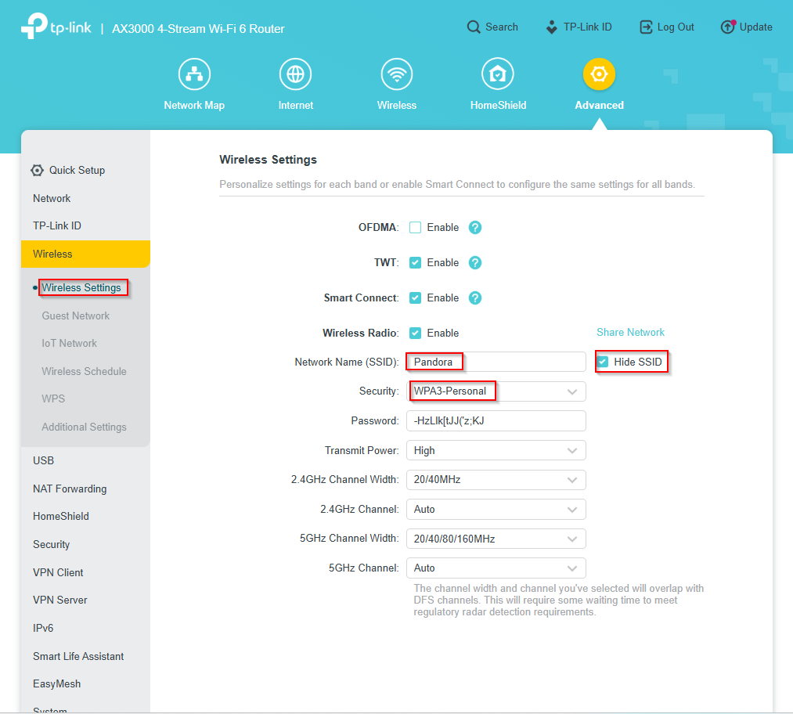

### 3.7 Segmentar la red: red de invitados e IoT

**Criticidad:** ALTA  
**Ruta:** `Advanced → Wireless → Guest Network`

Los dispositivos IoT suelen tener ciclos de soporte cortos y una postura de seguridad irregular. Si comparten segmento con los equipos principales, un compromiso en un dispositivo poco confiable puede facilitar el movimiento lateral dentro de la red.

En el emulador creé una red de invitados con SSID `Polifemo`, con `Hide SSID` activo, control de ancho de banda habilitado y aislamiento entre clientes. Además, las opciones **Allow guests to see each other** y **Allow guests to access your local network** permanecen desactivadas, que es la configuración correcta para separar la red de invitados de la LAN principal.

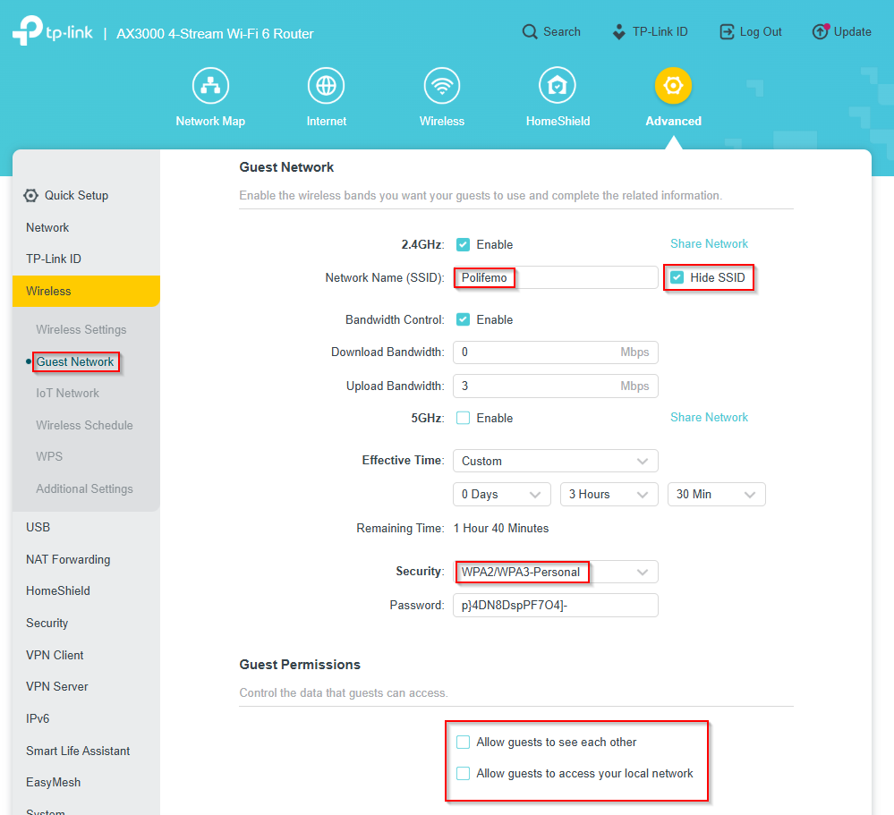

### 3.8 Deshabilitar servicios innecesarios

**Criticidad:** ALTA

Cada servicio activo añade superficie de ataque. Por eso, todo lo que no sea estrictamente necesario debe desactivarse para reducir exposición, complejidad y mantenimiento.

#### USB Storage y FTP

En la sección de almacenamiento USB desactivé Samba, Local FTP, Internet FTP y Local SFTP. Esta es la configuración adecuada si no se utiliza el puerto USB para compartir archivos en red. También dejé Media Sharing desactivado. La captura muestra además un usuario con permisos limitados en **Secure Sharing**, lo que aplica el principio de mínimo privilegio.

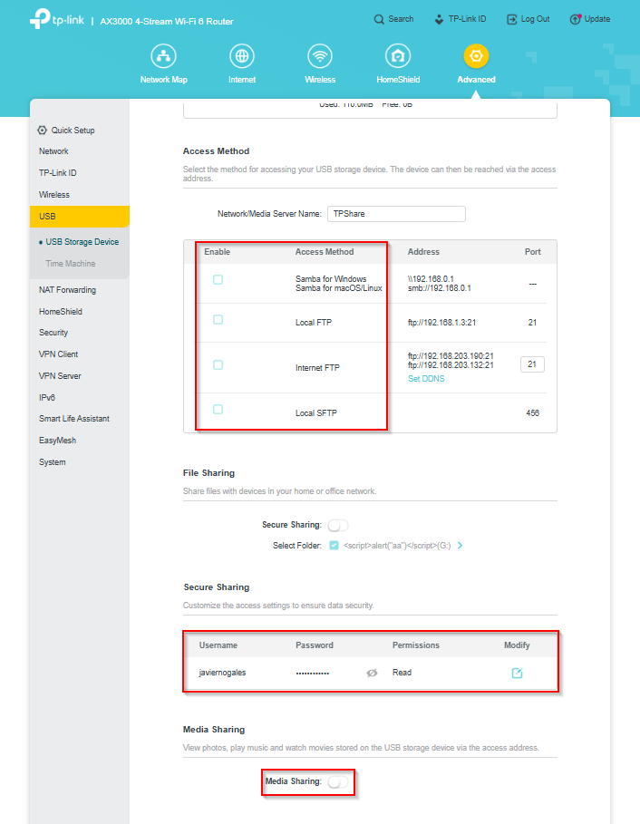

#### IPTV/VLAN e IGMP

Si el ISP no requiere IPTV, no hay motivo para mantener activos IPTV/VLAN, IGMP Proxy o IGMP Snooping. En el emulador desactivé estas opciones, reduciendo componentes innecesarios del firmware.

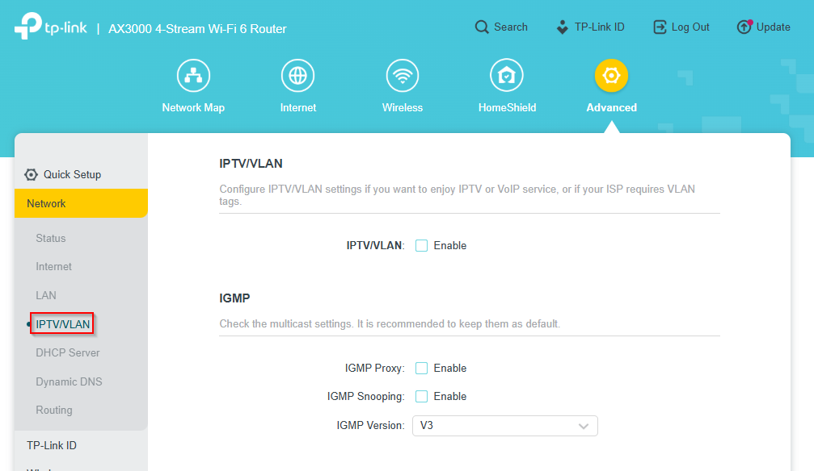

#### IPv6

Si la red no necesita conectividad IPv6 nativa, deshabilitarla reduce la complejidad del entorno y evita dejar expuesta una pila adicional de protocolos. En el emulador IPv6 aparece desactivado, que es la opción más prudente en un escenario donde no se use.

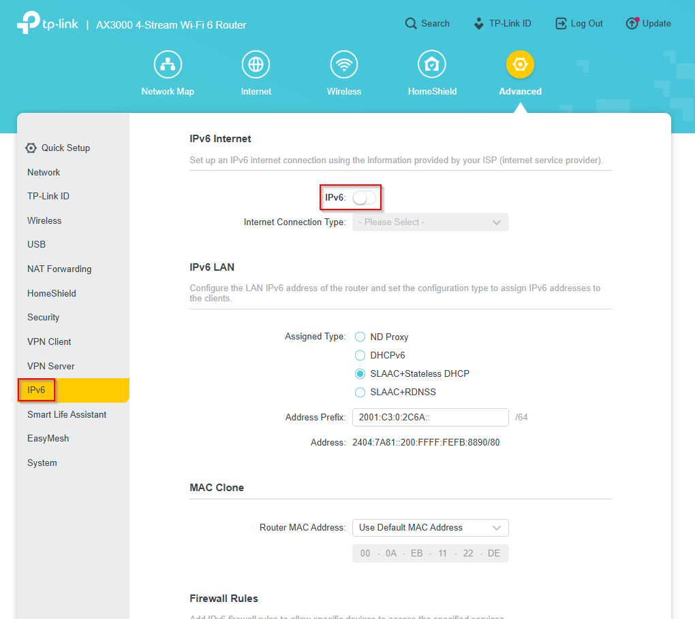

### 3.9 Configurar el firewall SPI

**Criticidad:** ALTA  
**Ruta:** `Advanced → Security → Firewall`

El firewall SPI inspecciona el estado de las conexiones y descarta tráfico entrante no relacionado con sesiones iniciadas desde la red interna. Esto dificulta que tráfico no solicitado desde Internet llegue directamente a la LAN.

En el emulador verifiqué que **SPI Firewall** está activo y que tanto **Respond to Pings from LAN** como **Respond to Pings from WAN** están desactivados. No responder a pings desde WAN reduce la detectabilidad del router en escaneos externos.

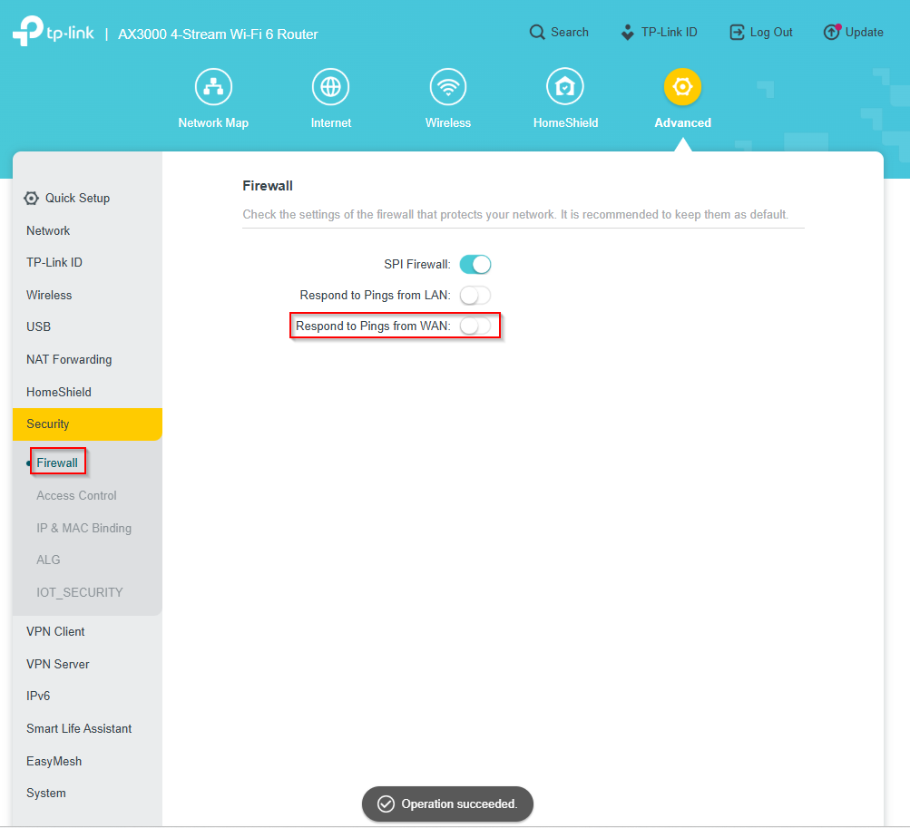

**Pasos aplicados:**
1. Verificar que **SPI Firewall** está activo.
2. Mantener **Respond to Pings from WAN** desactivado.
3. Mantener **Respond to Pings from LAN** desactivado salvo necesidad de diagnóstico puntual.

### 3.10 Configurar acceso remoto seguro mediante VPN

**Criticidad:** MEDIA  
**Ruta:** `Advanced → VPN Server → OpenVPN`

Si se requiere acceso remoto a la red doméstica, la alternativa segura consiste en usar una VPN en lugar de exponer servicios directamente. De este modo, el acceso queda encapsulado y no se publican interfaces de administración innecesarias en Internet.

En el emulador desactivé todos los servidores VPN, que es la configuración correcta cuando no se necesita acceso externo. También dejé **VPN Client** desactivado. Si en el futuro fuera necesario habilitar acceso remoto, OpenVPN sería la opción preferente entre las disponibles.

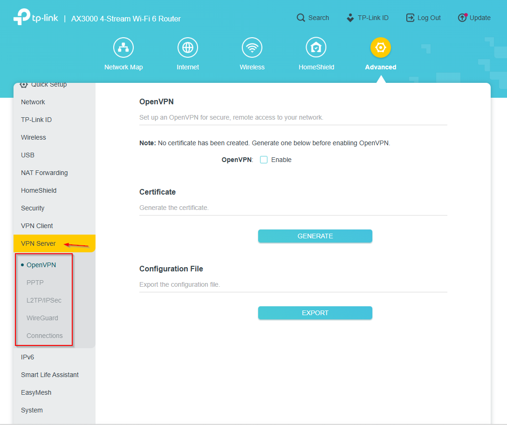

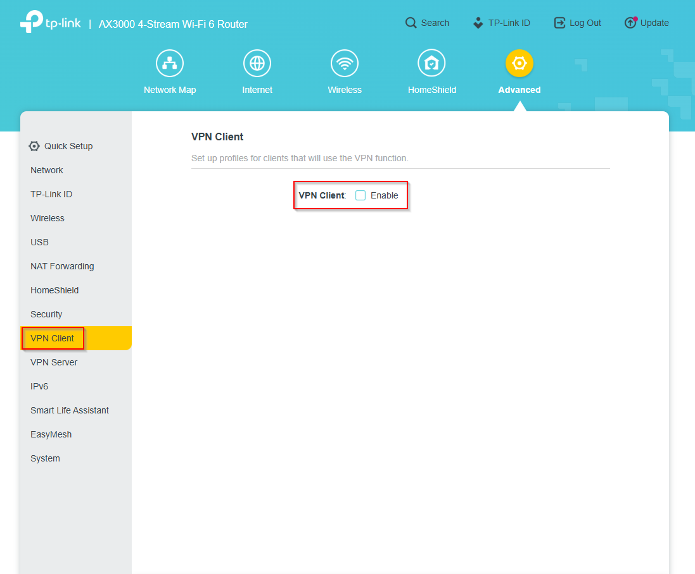

| Protocolo | Recomendación | Motivo |
|-----------|--------------|--------|
| OpenVPN | Recomendado si se necesita VPN | Protocolo maduro, bien auditado y ampliamente compatible. |
| WireGuard | Usar con precaución | CVE-2025-7850 afecta a configuraciones WireGuard en ciertos firmwares. |
| L2TP/IPSec | No recomendado | Protocolo legacy con implementaciones históricamente débiles. |
| PPTP | Prohibido | Roto criptográficamente desde 2012; no ofrece seguridad real. |

### 3.11 Configurar servidores DNS seguros

**Criticidad:** MEDIA  
**Ruta:** `Network → DHCP Server`

Los servidores DNS asignados por DHCP determinan a qué resolutor consultan todos los dispositivos de la red. Si se usan resolutores poco fiables o comprometidos, el tráfico puede ser redirigido o las consultas pueden ser registradas sin necesidad.

En el emulador configuré **Primary DNS** en `1.0.0.1` y **Secondary DNS** en `1.1.1.1` de Cloudflare. Además, reduje el pool DHCP de `.100` a `.115`, lo que limita el rango a 16 direcciones y resulta suficiente para un entorno doméstico o SOHO. Las entradas de **Address Reservation** permanecen activas para vincular dispositivos concretos a IPs fijas.

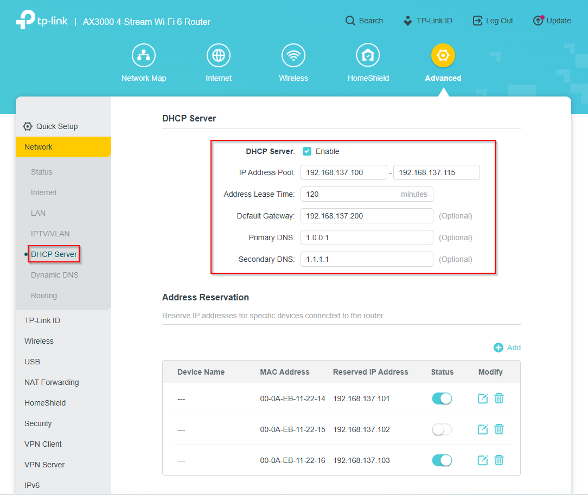

### 3.12 Activar y monitorizar los logs del sistema

**Criticidad:** MEDIA  
**Ruta:** `Advanced → System → System Log`

Los logs son esenciales para detectar intentos de acceso repetidos, cambios de configuración no autorizados, conexiones anómalas o reinicios inesperados. Sin registros, es mucho más difícil reconstruir un incidente o detectar actividad maliciosa a tiempo.

En esta guía prioricé el uso del correo oficial para alertas y la revisión de eventos. La idea es que el sistema de registro quede activo y que la monitorización forme parte del mantenimiento del router.

### 3.13 Bastionado físico del dispositivo

**Criticidad:** MEDIA

La seguridad lógica puede anularse si un atacante tiene acceso físico al router. El botón de reset puede devolver el dispositivo a fábrica sin autenticación, por lo que el control físico sigue siendo una capa importante de defensa.

| Medida | Justificación |
|--------|---------------|
| Ubicar el router en una zona de acceso restringido | El botón de reset restaura la configuración por defecto y elimina las medidas aplicadas. |
| Deshabilitar el botón WPS físico | `Advanced → Wireless → WPS`. Aunque WPS esté desactivado por software, el botón físico puede reactivarlo. |
| Revisar quién tiene acceso físico en entornos compartidos | En pisos compartidos u oficinas, el acceso físico es un vector de ataque real. |

---

## 4. Mantenimiento y revisión periódica

El bastionado de un router no es una acción puntual, sino un proceso continuo. Conviene revisar periódicamente el firmware, la configuración y los registros para asegurarse de que el nivel de seguridad se mantiene con el tiempo.

| Tarea | Frecuencia | Herramienta |
|-------|-----------|-------------|
| Verificar disponibilidad de nuevo firmware | Mensual | Portal oficial de TP-Link / Auto-update |
| Revisar avisos de seguridad de TP-Link | Mensual | [https://www.tp-link.com/us/press/security-advisory/](https://www.tp-link.com/us/press/security-advisory/) |
| Revisar logs del sistema | Semanal | Panel web → `System Log` |
| Auditar dispositivos conectados a la red | Mensual | `Advanced → Network Map` |
| Verificar que no hay port-forwardings no reconocidos | Mensual | `Advanced → NAT Forwarding` |
| Revisar la configuración completa del router | Cada 90 días | Panel web completo |
| Cambiar contraseñas Wi‑Fi | Cada 6–12 meses | `Wireless → Wireless Settings` |

---

## Anexo — Crítica a la documentación oficial y medidas adicionales

Este anexo amplía la guía principal con observaciones críticas sobre recomendaciones públicas del fabricante y con medidas adicionales de bastionado aplicables al Archer AX55. El contenido completo del anexo se encuentra en un documento independiente para mantener separadas la guía principal y la revisión complementaria.

**Enlace al anexo:** [Anexo de revisión crítica](anexo.md)