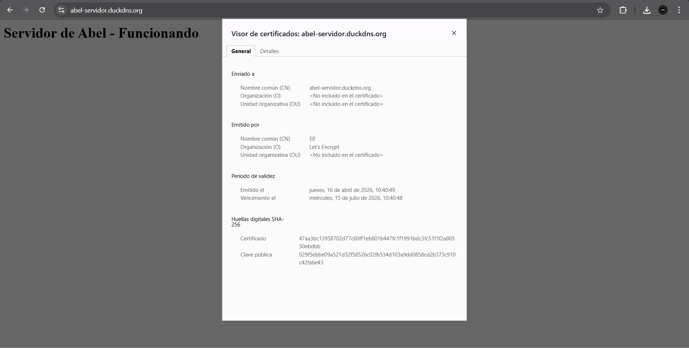
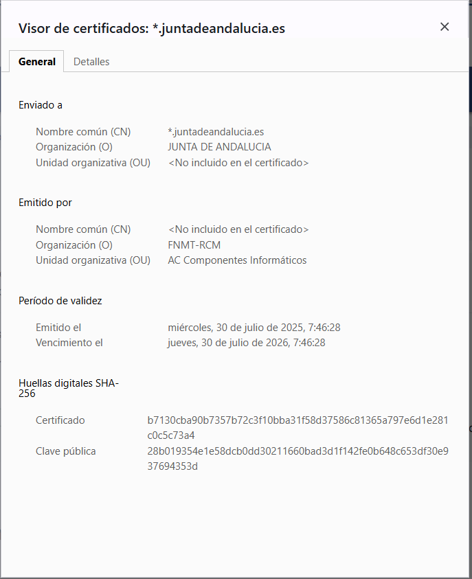

# Proyecto 9: Certificados digitales. Parte 2

*Abel García Domínguez*

# Análisis Comparativo de Certificados SSL/TLS

## 1. Información General

| Campo | Abel (abel-servidor.duckdns.org) | Junta de Andalucía (\*.juntadeandalucia.es) |
|---|---|---|
| **Dominio (CN)** | abel-servidor.duckdns.org | \*.juntadeandalucia.es |
| **Tipo de dominio** | DNS dinámico (DuckDNS) | Dominio institucional propio |
| **Cobertura** | Dominio único | Wildcard (todos los subdominios) |

---

## 2. Entidad Emisora (Autoridad Certificadora)

### 2.1 Certificado de Abel

| Campo | Valor |
|---|---|
| **Nombre común (CN)** | E8 |
| **Organización (O)** | Let's Encrypt |
| **Unidad organizativa (OU)** | No incluido |

**Let's Encrypt** es una Autoridad Certificadora (CA) pública, gratuita y automatizada, gestionada por la organización sin ánimo de lucro *Internet Security Research Group (ISRG)*. Emite certificados de tipo **DV (Domain Validation)**, que únicamente verifican que el solicitante controla el dominio, sin validar identidad legal ni organizativa.

### 2.2 Certificado de la Junta de Andalucía

| Campo | Valor |
|---|---|
| **Nombre común (CN)** | No incluido en el certificado |
| **Organización (O)** | FNMT-RCM |
| **Unidad organizativa (OU)** | AC Componentes Informáticos |

**FNMT-RCM** (Fábrica Nacional de Moneda y Timbre – Real Casa de la Moneda) es la Autoridad Certificadora oficial del Estado español. Forma parte de la infraestructura PKI del gobierno y emite certificados con validación organizativa u extendida, garantizando la identidad legal de la entidad. Su uso es característico de administraciones públicas y organismos oficiales.

### 2.3 Comparativa de nivel de confianza

| Aspecto | Let's Encrypt | FNMT-RCM |
|---|---|---|
| **Tipo de validación** | DV – Solo dominio | OV/EV – Organizativa/Extendida |
| **Verificación de identidad** | No | Sí |
| **Coste** | Gratuito | De pago / Institucional |
| **Ámbito de uso** | General / Personal | Administración pública española |
| **Reconocimiento legal** | Internacional (técnico) | Legal en España (eIDAS) |

---

## 3. Período de Validez

| Campo | Abel | Junta de Andalucía |
|---|---|---|
| **Fecha de emisión** | 16 de abril de 2026, 10:40:49 | 30 de julio de 2025, 7:46:28 |
| **Fecha de vencimiento** | 15 de julio de 2026, 10:40:48 | 30 de julio de 2026, 7:46:28 |
| **Duración total** | ~90 días (3 meses) | ~365 días (1 año) |

### Análisis de duración

- El certificado de **Abel** tiene una duración de **90 días**, lo cual es estándar para Let's Encrypt. Esta corta duración incentiva la automatización de la renovación (mediante herramientas como *Certbot*) y mejora la seguridad al reducir la ventana de exposición si una clave privada se ve comprometida.

- El certificado de la **Junta de Andalucía** tiene una duración de **1 año**, habitual en CAs comerciales e institucionales. Requiere gestión manual o semi-automatizada de la renovación.

---

## 4. Huellas Digitales SHA-256

Las huellas digitales (fingerprints) son identificadores únicos de cada certificado. Permiten verificar su autenticidad e integridad.

### 4.1 Certificado de Abel

| Campo | Valor |
|---|---|
| **Huella del certificado** | `47aa3bc13958702d77c60ff1eb801b447fc1f1991bdc3fc51f3f2a80550ebdbb` |
| **Clave pública** | `029f5ebbe09a521d32f58526c02fb534d103a9dd0858cd2b373c910c42fa6e43` |

### 4.2 Certificado de la Junta de Andalucía

| Campo | Valor |
|---|---|
| **Huella del certificado** | `b7130cba90b7357b72c3f10bba31f58d37586c81365a797e6d1e281c0c5c73a4` |
| **Clave pública** | `28b019354e1e58dcb0dd30211660bad3d1f142fe0b648c653df30e937694353d` |

Ambos utilizan el algoritmo **SHA-256**, que actualmente es el estándar de la industria y se considera criptográficamente seguro.

---

## 5. Resumen de Diferencias Clave

| Característica | Abel | Junta de Andalucía |
|---|---|---|
| **Tipo de sitio** | Servidor personal | Portal institucional público |
| **Dominio** | DNS dinámico (duckdns.org) | Dominio gubernamental (.es) |
| **Cobertura del certificado** | Un solo dominio | Wildcard (\*.juntadeandalucia.es) |
| **Autoridad Certificadora** | Let's Encrypt (gratuita) | FNMT-RCM (estatal) |
| **Nivel de validación** | DV (solo dominio) | OV/EV (organizativa) |
| **Verificación de identidad** | No | Sí |
| **Duración** | 90 días | 1 año |
| **Renovación** | Automatizada (Certbot) | Manual / Gestionada |
| **Coste** | Gratuito | Institucional |
| **Algoritmo de huella** | SHA-256 | SHA-256 |

---

## 6. Conclusiones

Ambos certificados son técnicamente válidos y cumplen su objetivo de proporcionar comunicaciones cifradas (HTTPS). Sin embargo, responden a necesidades muy distintas:

- El certificado de **Abel** es ideal para un servidor personal o proyecto de desarrollo. Let's Encrypt democratiza el acceso al cifrado web, permitiendo a cualquier persona obtener un certificado gratuito y fiable. Su corta validez y renovación automática lo hacen eficiente y seguro para este tipo de uso.

- El certificado de la **Junta de Andalucía** está respaldado por la autoridad certificadora oficial del Estado español (FNMT-RCM), lo que le otorga validez legal e institucional. El uso de un certificado wildcard permite cubrir todos los subdominios de la organización con un único certificado, lo cual es habitual en grandes organizaciones. Su duración anual y la validación organizativa garantizan un nivel de confianza superior, adecuado para servicios públicos.
