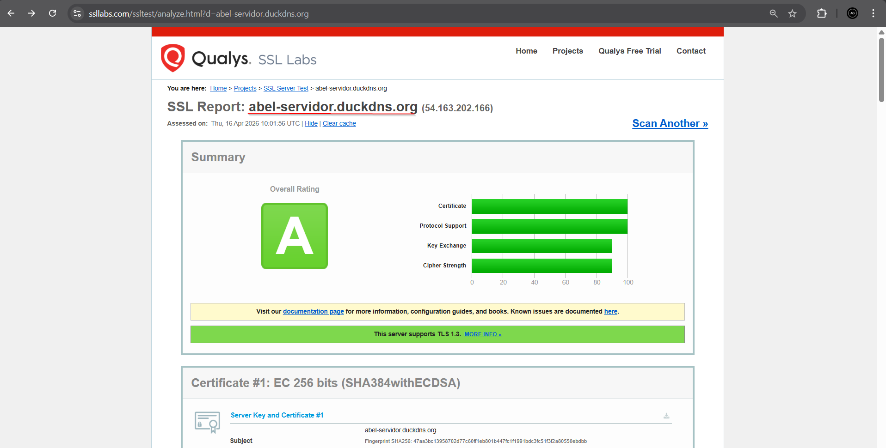

# Proyecto 9: Certificados digitales. Parte 3

*Abel García Domínguez*

# Análisis SSL Labs – abel-servidor.duckdns.org

---

## ¿Por qué el certificado es válido?

SSL Labs otorga la validez y puntuación a un certificado y servidor basándose en cuatro categorías. A continuación se explica cada una con los datos del análisis.

---

### 1. Certificado

El certificado es válido por los siguientes motivos:

- **Emitido por una CA de confianza:** Let's Encrypt (a través de su intermediario E8, firmado por ISRG Root X1), que es reconocida como CA de confianza por Mozilla, Apple, Android, Java y Windows.
- **No revocado:** El estado de revocación consultado vía CRL indica *Good (not revoked)*, lo que significa que el certificado no ha sido anulado por la CA.
- **Dentro del período de validez:** Emitido el 16 de abril de 2026 y válido hasta el 15 de julio de 2026, por lo que en la fecha del análisis estaba completamente vigente.
- **Nombre del dominio coincidente:** El CN y el nombre alternativo (SAN) son ambos `abel-servidor.duckdns.org`, que coincide exactamente con el dominio analizado.
- **Certificate Transparency:** El certificado está registrado en los logs públicos de transparencia de certificados (CT), lo que permite detectar emisiones fraudulentas y es un requisito de los navegadores modernos.
- **Clave no débil:** La clave EC de 256 bits no corresponde a ninguna clave débil conocida.
- **Cadena de certificados completa y sin errores:** Se proporcionan 2 certificados en la cadena (el propio y el intermedio E8) sin problemas detectados.
---

### 2. Soporte de Protocolos

El servidor tiene una configuración de protocolos muy segura:

- **TLS 1.3 y TLS 1.2 habilitados**, que son los únicos protocolos modernos y seguros aceptados actualmente.
- **TLS 1.1, TLS 1.0, SSL 3 y SSL 2 deshabilitados**, eliminando todos los protocolos obsoletos y vulnerables.

Esto garantiza que solo se acepten conexiones con versiones del protocolo que no tienen vulnerabilidades conocidas graves.

---

### 3. Intercambio de Claves

- Se utiliza **ECDH (Elliptic Curve Diffie-Hellman)** con curvas x25519 y secp521r1, que son consideradas seguras y eficientes.
- Todas las suites de cifrado soportadas implementan **Forward Secrecy (FS)**, lo que significa que aunque la clave privada del servidor fuese comprometida en el futuro, las sesiones pasadas no podrían ser descifradas.
- La fortaleza equivalente del intercambio de claves es de 3072 bits RSA o hasta 15360 bits RSA, muy por encima del mínimo recomendado.

---

### 4. Fortaleza del Cifrado

Las suites de cifrado soportadas son:

| Suite | Bits |
|---|---|
| TLS_AES_128_GCM_SHA256 | 128 |
| TLS_AES_256_GCM_SHA384 | 256 |
| TLS_CHACHA20_POLY1305_SHA256 | 256 |
| TLS_ECDHE_ECDSA_WITH_AES_128_GCM_SHA256 | 128 |
| TLS_ECDHE_ECDSA_WITH_AES_256_GCM_SHA384 | 256 |
| TLS_ECDHE_ECDSA_WITH_CHACHA20_POLY1305_SHA256 | 256 |

Todos los cifrados son modernos y seguros. No se usa RC4, ni cifrados nulos, ni suites con claves débiles.

---

### 5. Ausencia de Vulnerabilidades Conocidas

El análisis confirma que el servidor **no es vulnerable** a ninguno de los ataques analizados:

| Vulnerabilidad | Estado |
|---|---|
| BEAST | Mitigado |
| POODLE (SSLv3 y TLS) | No vulnerable |
| Heartbleed | No vulnerable |
| ROBOT | No vulnerable |
| Downgrade attack (FALLBACK_SCSV) | Protegido |
| OpenSSL CCS (CVE-2014-0224) | No vulnerable |
| Ticketbleed | No vulnerable |

---

## Conclusión

El certificado de `abel-servidor.duckdns.org` es considerado válido y obtiene una puntuación A porque cumple todos los criterios fundamentales: está emitido por una CA reconocida, no está revocado, está dentro de su período de validez, el dominio coincide, utiliza únicamente protocolos modernos (TLS 1.2 y 1.3), emplea cifrados fuertes con Forward Secrecy, y no presenta ninguna vulnerabilidad conocida. La implementación es sólida y adecuada para un servidor personal.

---

# Análisis certificados web erróneos
