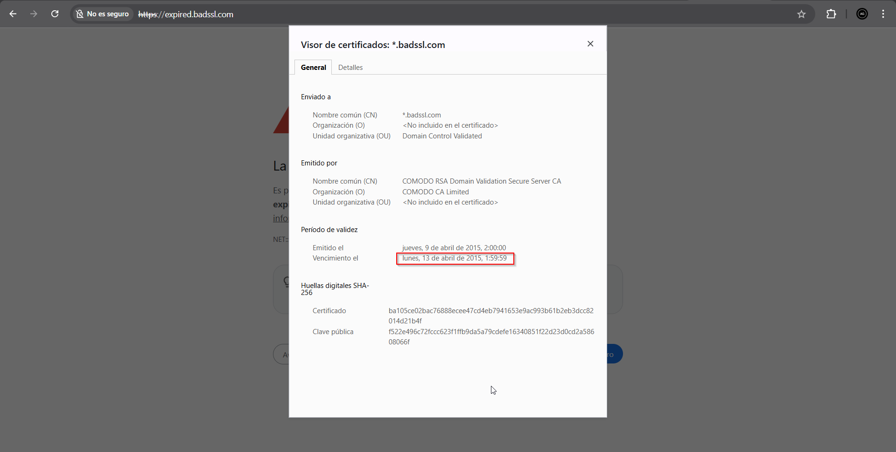
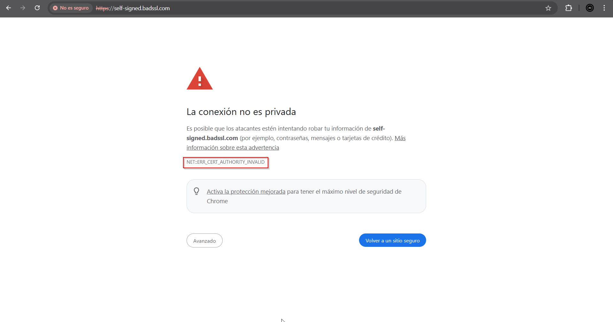
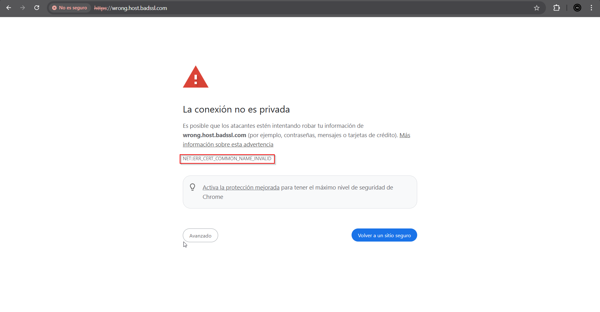

# Proyecto 9: Certificados digitales. Parte 3

*Abel García Domínguez*

# 1. Análisis SSL Labs – abel-servidor.duckdns.org

---

## 1.1 Por qué el certificado es válido?

SSL Labs otorga la validez y puntuación a un certificado y servidor basándose en cuatro categorías. A continuación se explica cada una con los datos del análisis.

---

## 1.2 Certificado

El certificado es válido por los siguientes motivos:

- **Emitido por una CA de confianza:** Let's Encrypt (a través de su intermediario E8, firmado por ISRG Root X1), que es reconocida como CA de confianza por Mozilla, Apple, Android, Java y Windows.
- **No revocado:** El estado de revocación consultado vía CRL indica *Good (not revoked)*, lo que significa que el certificado no ha sido anulado por la CA.
- **Dentro del período de validez:** Emitido el 16 de abril de 2026 y válido hasta el 15 de julio de 2026, por lo que en la fecha del análisis estaba completamente vigente.
- **Nombre del dominio coincidente:** El CN y el nombre alternativo (SAN) son ambos `abel-servidor.duckdns.org`, que coincide exactamente con el dominio analizado.
- **Certificate Transparency:** El certificado está registrado en los logs públicos de transparencia de certificados (CT), lo que permite detectar emisiones fraudulentas y es un requisito de los navegadores modernos.
- **Clave no débil:** La clave EC de 256 bits no corresponde a ninguna clave débil conocida.
- **Cadena de certificados completa y sin errores:** Se proporcionan 2 certificados en la cadena (el propio y el intermedio E8) sin problemas detectados.
---

## 1.3 Soporte de Protocolos

El servidor tiene una configuración de protocolos muy segura:

- **TLS 1.3 y TLS 1.2 habilitados**, que son los únicos protocolos modernos y seguros aceptados actualmente.
- **TLS 1.1, TLS 1.0, SSL 3 y SSL 2 deshabilitados**, eliminando todos los protocolos obsoletos y vulnerables.

Esto garantiza que solo se acepten conexiones con versiones del protocolo que no tienen vulnerabilidades conocidas graves.

---

## 1.4 Intercambio de Claves

- Se utiliza **ECDH (Elliptic Curve Diffie-Hellman)** con curvas x25519 y secp521r1, que son consideradas seguras y eficientes.
- Todas las suites de cifrado soportadas implementan **Forward Secrecy (FS)**, lo que significa que aunque la clave privada del servidor fuese comprometida en el futuro, las sesiones pasadas no podrían ser descifradas.
- La fortaleza equivalente del intercambio de claves es de 3072 bits RSA o hasta 15360 bits RSA, muy por encima del mínimo recomendado.

---

## 1.5 Fortaleza del Cifrado

Todos los cifrados son modernos y seguros. No se usa RC4, ni cifrados nulos, ni suites con claves débiles.

---

## 1.6 Ausencia de Vulnerabilidades Conocidas

El análisis confirma que el servidor **no es vulnerable** a ninguno de los ataques analizados:

| Vulnerabilidad | Estado |
|---|---|
| BEAST | Mitigado |
| POODLE (SSLv3 y TLS) | No vulnerable |
| Heartbleed | No vulnerable |
| ROBOT | No vulnerable |
| Downgrade attack (FALLBACK_SCSV) | Protegido |
| OpenSSL CCS (CVE-2014-0224) | No vulnerable |
| Ticketbleed | No vulnerable |

---

## 1.7 Conclusión

El certificado de `abel-servidor.duckdns.org` es considerado válido y obtiene una puntuación A porque cumple todos los criterios fundamentales: está emitido por una CA reconocida, no está revocado, está dentro de su período de validez, el dominio coincide, utiliza únicamente protocolos modernos (TLS 1.2 y 1.3), emplea cifrados fuertes con Forward Secrecy, y no presenta ninguna vulnerabilidad conocida. La implementación es sólida y adecuada para un servidor personal.

---

# 2. Análisis certificados web erróneos

Para este análisis se han utilizado los tres subdominios de **badssl.com**, un entorno de referencia mantenido por el equipo de Chromium/Google específicamente para testear comportamientos de navegadores ante certificados inválidos. Cada caso representa un tipo de error distinto. El análisis técnico se realizó con **SSL Labs.**

---

## 2.1 Certificado caducado — `expired.badssl.com`

**Tipo de error:** Certificado expirado (`NET::ERR_CERT_DATE_INVALID`)

**Descripción:**  
El certificado de este servidor tiene fecha de expiración en **2015**, lo que significa que lleva más de **10 años caducado**. Cada certificado SSL/TLS tiene un período de validez definido (actualmente limitado a 1 año por los requisitos del CA/Browser Forum). Una vez superada la fecha `Not After`, los navegadores y clientes TLS lo rechazan automáticamente.

**Motivo de invalidez:**  
El navegador compara la fecha actual del sistema con el campo `notAfter` del certificado. Si `fecha_actual > notAfter`, el certificado se considera expirado y la conexión es bloqueada. Este es el error más común en producción y suele deberse a fallos en los procesos de renovación automática.

[Análisis de SSL Labs](report-SSL-web_erroneas/expired-badssl-com-analisis.pdf)

---

## 2.2 Certificado autofirmado — `self-signed.badssl.com`

**Tipo de error:** Certificado sin cadena de confianza (`NET::ERR_CERT_AUTHORITY_INVALID`)

**Descripción:**  
El certificado de este servidor ha sido emitido y firmado por el **propio servidor**, sin intervención de ninguna Autoridad de Certificación (CA) reconocida. Esto significa que aunque el certificado esté técnicamente en vigor y el cifrado sea correcto, no existe ninguna entidad externa que haya verificado la identidad del titular.

**Motivo de invalidez:**  
Los navegadores y sistemas operativos mantienen un **almacén de certificados raíz de confianza**. Para que un certificado sea válido, debe existir una cadena verificable desde el certificado del servidor hasta una CA raíz presente en ese almacén. Un certificado autofirmado rompe esta cadena: su emisor y su sujeto son el mismo, por lo que no hay tercero que avale la identidad.

[Análisis de SSL Labs](report-SSL-web_erroneas/self-signed-badssl-com-analisis.pdf)

---

## 2.3 Nombre de dominio no coincidente — `wrong.host.badssl.com`

**Tipo de error:** Mismatch de nombre de host (`NET::ERR_CERT_COMMON_NAME_INVALID`)

**Descripción:**  
Un certificado wildcard (`*.badssl.com`) cubre cualquier subdominio de un único nivel: `foo.badssl.com`, `bar.badssl.com`. El problema es que `wrong.host.badssl.com` tiene **dos niveles de subdominio**, y el asterisco solo puede sustituir uno. Por tanto, el certificado no cubre este dominio.

**Motivo de invalidez:**  
Cuando el navegador descarga el certificado del servidor, busca en sus campos `Common Name (CN)` y `Subject Alternative Names (SAN)` si alguno coincide con el dominio al que se está accediendo. En este caso encuentra `*.badssl.com`, intenta hacer coincidir `wrong.host.badssl.com` con ese patrón, y falla porque el `*` solo puede sustituir una etiqueta sin puntos. El navegador bloquea la conexión con el error `NET::ERR_CERT_COMMON_NAME_INVALID`.

[Análisis de SSL Labs](report-SSL-web_erroneas/wrong-host-badssl-com-analisis.pdf)

---

# Tabla resumen

| Sitio | Tipo de error | Código de error | Motivo técnico |
|---|---|---|---|
| `expired.badssl.com` | Certificado caducado | `ERR_CERT_DATE_INVALID` | Certificado expirado en 2015 |
| `self-signed.badssl.com` | Certificado autofirmado | `ERR_CERT_AUTHORITY_INVALID` | Sin cadena de confianza hacia CA raíz reconocida |
| `wrong.host.badssl.com` | Nombre no coincidente | `ERR_CERT_COMMON_NAME_INVALID` | Wildcard `*.badssl.com` no cubre subdominios de 3er nivel|